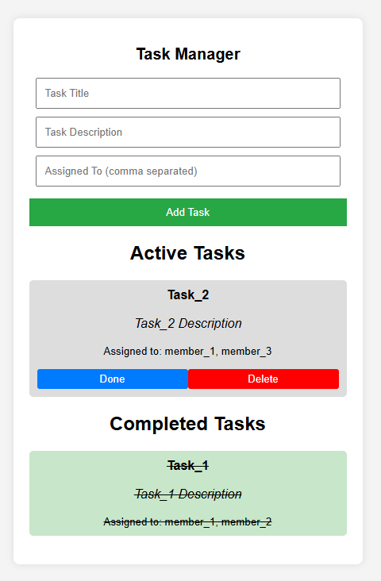

# Task Manager

A simple task manager built with JavaScript, HTML, and CSS.

## Features
- Add tasks with a title, description, and assigned people.
- Mark tasks as "Done" and move them to the Completed section.
- Delete tasks.

## Technologies Used
- **JavaScript** for dynamic functionality
- **HTML** for page structure
- **CSS** for styling and layout

## How to Use
1. Open `index.html` in a browser.
2. Enter a task title, description, and assigned people.
3. Click "Add Task" to save it.
4. Click "Done" to archive it or "Delete" to remove it.

## Preview

## Author
Created by **[Vlad-Mihai Crețu](https://github.com/VladMihai2002)**
